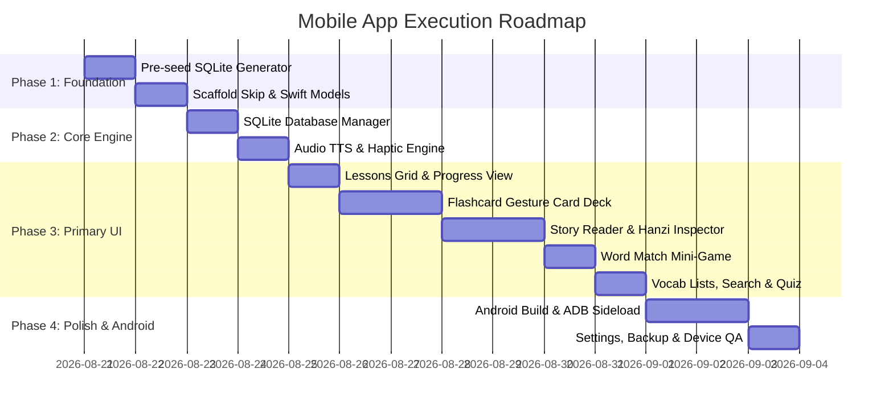

# Implementation Plan: Chinese Study Mobile App (iOS & Android)

## 1. Project Overview & Objectives

The goal of this project is to build a high-performance, offline-first mobile application for studying Chinese characters on both **iOS** and **Android**, with **Swift & SwiftUI** as the foundational codebase.

The mobile app achieves full functional parity with the existing desktop/web version while re-architecting the interaction model for mobile touch screens (gestures, haptics, native Text-To-Speech audio, and mobile navigation).

### Core Goals
1. **Swift-First Architecture:** Modern Swift (Swift 5.10 / Swift 6) and SwiftUI as the unified codebase.
2. **Android Execution via Skip:** Compile and run directly on a physical Android phone using **Skip.tools** (`skip.tools`) into native Kotlin & Jetpack Compose.
3. **100% Offline Resilience:** Zero-cloud dependency; pre-compiled SQLite database with full data persistence for user progress.
4. **Direct Device Deployment:** Streamlined developer-mode APK build and ADB sideloading onto Android phone without app store distribution overhead.

---

## 2. Requirements & Feature Specifications

### 2.1 Character Database & Curriculum (3,000 Hanzi)
* **Dataset:** 3,000 high-frequency Chinese characters split into **120 lessons** (25 characters per lesson), ordered strictly by frequency rank.
* **Metadata per Character:**
  * `frequency_rank` (1 – 3,000)
  * `character` (Hanzi glyph)
  * `pinyin` (Tone-marked pinyin)
  * `definition` (English gloss/definition)
  * `radical` & `radical_code` (Radical decomposition)
  * `stroke_count`
  * `hsk_level` (HSK 1 through HSK 6)
  * `lesson_number` (1 through 120)
  * `example_sentence` (Chinese sentence, pinyin, English translation)
  * `word_associations` (Common 2-4 character words containing the target Hanzi)

### 2.2 Learning Status Lifecycle
* **Three Statuses:**
  * `new` (Unstudied default)
  * `in-progress` (Currently learning / needs review)
  * `learned` (Mastered)
* **Status Transitions:** Instant persistence to SQLite with millisecond timestamps (`updated_at`).
* **Progress Tracking:** Lesson-level progress bars (Learned count, In-Progress count, Remaining new count) and global dashboard statistics.

### 2.3 Flashcard Study Engine
* **Card Presentation:**
  * **Front:** Large, crisp Hanzi character glyph with tone color accent, lesson badge, frequency rank badge.
  * **Back:** Pinyin with tones, English definition, Radical/Strokes breakdown, interactive Example Sentence popover, and Word Associations list.
* **Mobile Touch Interactions (Replacing Desktop Vim bindings):**
  * **Tap Card:** Smooth 3D flip animation (`rotation3DEffect`) with tactile haptic tick.
  * **Swipe Right (or Green Button):** Mark as **`learned`** ➔ advance to next card with celebration haptic.
  * **Swipe Left (or Amber Button):** Mark as **`in-progress`** ➔ advance to next card.
  * **Swipe Down / Scrubber:** Jump between cards or view card deck scrubber.
  * **Audio Button:** Pronounce the character using native Mandarin Text-to-Speech (`AVSpeechSynthesizer` / Android TTS).

### 2.4 Interactive Story Reader (Graded Reading)
* **Curriculum:** HSK-graded classical and modern Chinese stories (e.g., *塞翁失马*, *守株待兔*, *画蛇添足*, etc.).
* **Features:**
  * **Sentence-by-Sentence Narration:** Play audio for individual sentences or continuous story playback with adjustable speed (0.75x, 1.0x, 1.25x).
  * **Pinyin Display Modes:** `Ruby` (pinyin directly above characters), `Line` (inline pinyin line), or `None` (pure Hanzi immersion).
  * **English Translation Toggle:** Hide/show English translations per paragraph.
  * **Hanzi Inspector Popover:** Tapping any character opens an instant dictionary card showing its frequency rank, definition, and study status with quick status update buttons.
  * **Comprehension Quiz:** Multi-question quiz at the end of each story with instant feedback and explanations.

### 2.5 Word Match Mini-Game
* **Game Modes:** 4 pairs (Beginner), 6 pairs (Standard), 8 pairs (Challenge).
* **Pool Filter:** Studied characters only, HSK Core (top 600), or All 3,000.
* **Mechanics:** Tap left Hanzi and right matching character/definition. Visual streak counter, combo score multipliers, audio feedback, and confetti celebration on round completion.

### 2.6 Vocabulary Lists & Search
* **Tabs/Filters:**
  * Master All Characters (1–3,000)
  * In-Progress Review List
  * Learned Mastery List
* **Search & Filters:** Search by Hanzi, Pinyin, or English definition; filter by HSK Level (1–6); sort by frequency or status update time.
* **Batch Operations:** Mark all filtered results as Learned/In-Progress or launch a customized flashcard quiz.

### 2.7 Randomized Flashcard Quiz
* Launch randomized quizzes from any view (Learned words, In-Progress words, specific lesson, or full database).
* Summary results screen showing score, time elapsed, and review list of missed cards.

### 2.8 Study Stopwatch & Local Persistence
* Built-in stopwatch tracking active study sessions.
* **Database Backup & Migration:** Export user progress to JSON/SQLite file via iOS Share Sheet, import/restore backup with data integrity verification.

---

## 3. System Architecture & Tech Stack

```
┌────────────────────────────────────────────────────────────────────────┐
│                        Presentation Layer                              │
│  ┌──────────────┐ ┌──────────────┐ ┌──────────────┐ ┌──────────────┐   │
│  │ Lessons View │ │  Flashcards  │ │ Story Reader │ │  Word Match  │   │
│  └──────────────┘ └──────────────┘ └──────────────┘ └──────────────┘   │
└───────────────────────────────────┬────────────────────────────────────┘
                                    │ (SwiftUI State / Combine / MVVM)
┌───────────────────────────────────▼────────────────────────────────────┐
│                          Domain / ViewModels                           │
│  ┌──────────────────┐  ┌──────────────────┐  ┌──────────────────────┐  │
│  │ StudyDataViewModel│  │ StoryViewModel   │  │ WordMatchViewModel   │  │
│  └──────────────────┘  └──────────────────┘  └──────────────────────┘  │
└───────────────────────────────────┬────────────────────────────────────┘
                                    │
┌───────────────────────────────────▼────────────────────────────────────┐
│                           Services Layer                               │
│  ┌──────────────────┐  ┌──────────────────┐  ┌──────────────────────┐  │
│  │ Native Audio TTS │  │ Haptics Engine   │  │ Backup/Export Service│  │
│  └──────────────────┘  └──────────────────┘  └──────────────────────┘  │
└───────────────────────────────────┬────────────────────────────────────┘
                                    │
┌───────────────────────────────────▼────────────────────────────────────┐
│                         Data / Storage Layer                           │
│  ┌──────────────────────────────────────────────────────────────────┐  │
│  │  SQLite Database (Embedded hanzi_db.sqlite via GRDB / SQLite3)   │  │
│  │  Tables: characters | progress | study_sessions | word_assoc     │  │
│  └──────────────────────────────────────────────────────────────────┘  │
└────────────────────────────────────────────────────────────────────────┘
```

### 3.1 Tech Stack Breakdown

| Component | iOS Implementation | Android Implementation (via Skip) |
| :--- | :--- | :--- |
| **Language** | Swift 5.10 / Swift 6 | Swift transpiled to Kotlin |
| **UI Framework** | SwiftUI (iOS 17+) | Jetpack Compose (via SkipUI) |
| **Local Database** | SQLite via SkipSQL (`skiptools/skip-sql`) / SQLite3 | Android SQLite via SkipSQL / FFI |
| **Mandarin Speech** | `AVSpeechSynthesizer` (`zh-CN`) | `android.speech.tts.TextToSpeech` |
| **Haptic Feedback** | `UIImpactFeedbackGenerator` | `Vibrator` / `HapticFeedbackConstants` |
| **Navigation** | SwiftUI `TabView` + `NavigationStack` | Android Navigation Bar / Scaffold |
| **Packaging** | Xcode `.ipa` / TestFlight | Gradle `.aab` / Android Play Console |

### 3.2 Database Schema (Pre-Compiled in `hanzi_db.sqlite`)

```sql
-- Core 3,000 Characters (with embedded example sentences)
CREATE TABLE IF NOT EXISTS characters (
  frequency_rank INTEGER PRIMARY KEY,
  character TEXT NOT NULL,
  pinyin TEXT NOT NULL,
  definition TEXT NOT NULL,
  radical TEXT,
  radical_code TEXT,
  stroke_count INTEGER,
  hsk_level INTEGER,
  lesson_number INTEGER NOT NULL,
  example_zh TEXT,
  example_py TEXT,
  example_en TEXT
);

-- User Learning Progress
CREATE TABLE IF NOT EXISTS progress (
  character_id INTEGER PRIMARY KEY,
  status TEXT NOT NULL CHECK(status IN ('new', 'in-progress', 'learned')),
  updated_at INTEGER NOT NULL,
  FOREIGN KEY (character_id) REFERENCES characters(frequency_rank) ON DELETE CASCADE
);

-- Word Associations (8,868 Collocations)
CREATE TABLE IF NOT EXISTS word_associations (
  id INTEGER PRIMARY KEY AUTOINCREMENT,
  character_id INTEGER NOT NULL,
  character_char TEXT NOT NULL,
  word TEXT NOT NULL,
  pinyin TEXT NOT NULL,
  meaning TEXT NOT NULL,
  FOREIGN KEY (character_id) REFERENCES characters(frequency_rank)
);

-- Graded HSK Stories
CREATE TABLE IF NOT EXISTS stories (
  id TEXT PRIMARY KEY,
  title_zh TEXT NOT NULL,
  title_py TEXT NOT NULL,
  title_en TEXT NOT NULL,
  level TEXT NOT NULL,
  source TEXT NOT NULL,
  lesson_target TEXT NOT NULL,
  description TEXT NOT NULL,
  data_json TEXT NOT NULL
);

-- Study Sessions History
CREATE TABLE IF NOT EXISTS study_sessions (
  id INTEGER PRIMARY KEY AUTOINCREMENT,
  session_type TEXT NOT NULL,
  start_time INTEGER NOT NULL,
  duration_seconds INTEGER NOT NULL,
  cards_reviewed INTEGER NOT NULL,
  created_at INTEGER NOT NULL
);

-- Performance Indexes
CREATE INDEX IF NOT EXISTS idx_characters_lesson ON characters(lesson_number);
CREATE INDEX IF NOT EXISTS idx_characters_char ON characters(character);
CREATE INDEX IF NOT EXISTS idx_characters_hsk ON characters(hsk_level);
CREATE INDEX IF NOT EXISTS idx_progress_status ON progress(status);
CREATE INDEX IF NOT EXISTS idx_word_assoc_char ON word_associations(character_id);
CREATE INDEX IF NOT EXISTS idx_word_assoc_word ON word_associations(word);
```

---

## 4. File & Project Directory Structure

```
chinese-study-mobile/
├── .agents/
│   ├── implementation-plan.md     # This comprehensive blueprint
│   └── decisions.md               # Architectural & design decisions log
├── scripts/
│   └── seed_database.py           # Pre-compiles JSON data into binary hanzi_db.sqlite
├── ChineseStudyApp/
│   ├── App/
│   │   ├── ChineseStudyApp.swift   # App entry point (@main)
│   │   └── AppState.swift          # Global environment state (active tab, sound, timer)
│   ├── Models/
│   │   ├── Character.swift         # Character data model & status enum
│   │   ├── LessonInfo.swift        # Lesson calculations & progress stats
│   │   ├── Story.swift             # Stories, paragraphs, sentences, quizzes
│   │   ├── WordAssociation.swift   # Compound word model
│   │   └── StudySession.swift      # Session timer tracking model
│   ├── Database/
│   │   ├── DatabaseManager.swift   # SQLite connection, CRUD queries, migrations
│   │   └── Resources/
│   │       └── hanzi_db.sqlite     # Bundled pre-indexed SQLite database
│   ├── Services/
│   │   ├── AudioService.swift      # Mandarin TTS & sound effect synthesizer
│   │   ├── HapticsService.swift    # Tactile feedback generator
│   │   └── BackupService.swift     # JSON/SQLite export & import engine
│   ├── ViewModels/
│   │   ├── StudyDataViewModel.swift# Lessons, flashcards, and vocab state
│   │   ├── StoryViewModel.swift    # Story reader, audio playback, & quiz state
│   │   └── WordMatchViewModel.swift# Mini-game mechanics & streak tracking
│   ├── Views/
│   │   ├── MainTabView.swift       # Bottom navigation tab bar
│   │   ├── Lessons/
│   │   │   ├── LessonsGridView.swift      # 120 lessons grid with progress rings
│   │   │   └── LessonCardItemView.swift   # Individual lesson tile
│   │   ├── Flashcards/
│   │   │   ├── FlashcardStudyView.swift   # Card deck with swipe gestures
│   │   │   ├── FlashcardView.swift        # Front & Back 3D flip card
│   │   │   ├── ExampleSentenceSheet.swift # Popover with sentence & audio
│   │   │   └── CardScrubberView.swift     # Bottom thumbnail navigation
│   │   ├── Stories/
│   │   │   ├── StoryCatalogView.swift     # List of HSK stories
│   │   │   ├── StoryDetailReaderView.swift# Reader with ruby pinyin & sentence audio
│   │   │   ├── CharacterInspectorSheet.swift # Hanzi lookup modal
│   │   │   └── StoryQuizView.swift        # Comprehension quiz modal
│   │   ├── WordMatch/
│   │   │   ├── WordMatchGameView.swift    # Grid pairing game
│   │   │   └── MatchCardTile.swift        # Interactive tile button
│   │   ├── Vocab/
│   │   │   ├── VocabListView.swift        # Searchable list (Learned / In-Progress)
│   │   │   └── VocabRowView.swift         # Character row with quick status toggles
│   │   ├── Quiz/
│   │   │   └── QuickQuizModalView.swift   # Randomized flashcard quiz modal
│   │   └── Settings/
│   │       ├── SettingsView.swift         # Audio speed, sound toggles, database export
│   │       └── DatabaseBackupView.swift   # Backup / restore interface
│   ├── Components/
│   │   ├── CircularProgressView.swift     # Custom progress ring
│   │   ├── StopwatchHeaderView.swift      # Floating study stopwatch
│   │   └── AudioSpeakerButton.swift       # Animated TTS audio button
│   └── Assets.xcassets/
│       ├── AppIcon.appiconset             # 1024x1024 app icon
│       └── Colors.xcassets                # Adaptive light/dark palette & tone colors
├── Android/                               # Skip toolchain or Android Studio module
│   ├── build.gradle.kts
│   └── src/
└── README.md
```

---

## 5. Mobile UX & Gesture Mapping

To adapt the desktop keyboard/vim controls to mobile touch screens:

| Desktop Key / Action | Mobile Touch Equivalent | Tactile Feedback |
| :--- | :--- | :--- |
| **Flip Card (`h` / `l` / Space)** | **Tap Card** (3D Y-Axis Flip Animation) | Light impact tick |
| **Mark Learned (`j`)** | **Swipe Right** past 120px threshold or tap Green Check button | Medium success chime & double tap haptic |
| **Mark In-Progress (`k`)** | **Swipe Left** past 120px threshold or tap Amber Clock button | Soft thud haptic |
| **Next / Previous Card** | Horizontal pan drag or bottom arrow scrubber | Light selection tick |
| **Play Audio** | Tap Speaker icon (or automatic audio-on-flip setting) | Smooth sound playback |
| **Escape / Back** | Swipe down sheet or standard iOS back navigation | None |

---

## 6. Direct Android Device Deployment & Sideloading Playbook

### 6.1 Prerequisites
1. **Android Phone:** USB Debugging enabled (Settings ➔ Developer Options ➔ USB Debugging).
2. **Tools:** Android Debug Bridge (`adb`) installed (provided via Homebrew/Android Command Line Tools).
3. **Skip CLI:** Skip 1.9.7+ installed and verified via `skip doctor`.

### 6.2 Build & Run Commands
```bash
# 1. Check connected Android phone or emulator:
adb devices

# 2. Build and launch directly on connected Android phone:
skip app run --android

# 3. Export standalone debug/release APK:
skip export --android
# APK generated in ./Android/app/build/outputs/apk/debug/app-debug.apk

# 4. Install or update APK manually on Android phone:
adb install -r ./Android/app/build/outputs/apk/debug/app-debug.apk
```

---

## 7. Implementation Roadmap & Milestones



### Phase Details

* **Milestone 1 (Data & Storage):** Python script creates optimized `hanzi_db.sqlite` containing all 3,000 characters, word associations, and stories. Swift `DatabaseManager` runs zero-latency queries.
* **Milestone 2 (Core Study Experience):** Lessons Grid + Interactive Flashcard swipe deck with 3D flip, audio TTS, and haptic feedback.
* **Milestone 3 (Extended Features):** Graded Story Reader with sentence audio, Hanzi inspector popover, Word Match game, and searchable vocabulary table.
* **Milestone 4 (Android Device Deployment):** Transpile to Android using Skip, build `.apk`, install directly onto Android phone via ADB, and verify hardware audio/gestures.

