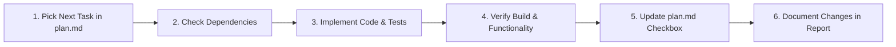

# Engineer Onboarding & Task Kickoff Briefing

> **Welcome to the Chinese Study Mobile team!**  
> This document is your operational onboarding briefing. Treat this as your primary starting prompt whenever you begin a new coding session.

---

## 1. Project Mission & Architecture Briefing

We are building a mobile application for learning 3,000 high-frequency Chinese characters with full offline functionality, flashcards, graded stories, mini-games, and native Mandarin audio.

* **Single Codebase in Swift:** You are writing **100% Swift (Swift 5.10 / Swift 6) & SwiftUI**.
* **Primary Target:** The app compiles and runs directly on an **Android phone** via **Skip.tools** (`skip.tools`) translating Swift/SwiftUI into native Kotlin & Jetpack Compose (and runs on iOS).
* **Storage Engine:** 100% offline SQLite database pre-compiled in `ChineseStudyApp/Database/Resources/hanzi_db.sqlite` accessed via **SkipSQL**.
* **Zero Cloud / Zero Network:** No remote servers, no analytics, no mandatory internet calls.

---

## 2. Your Required Reading (Source of Truth)

Before writing any code, familiarize yourself with these core documentation files:

1. 🧠 **[`AGENTS.md`](../AGENTS.md):** Workspace memory, coding rules, and core commands.
2. 📐 **[`.agents/implementation-plan.md`](./implementation-plan.md):** Full technical blueprint, database schema, and mobile gesture specifications.
3. ⚖️ **[`.agents/decisions.md`](./decisions.md):** Architecture Decision Records (ADRs). *Always check accepted ADRs before designing solutions.*
4. 📋 **[`.agents/plan.md`](./plan.md):** Master work breakdown tracker containing all 7 phases and task packages.

---

## 3. 🚨 The Prime Directive: Never Assume or Guess

As an engineer on this project, adhere strictly to the **Anti-Assumption Protocol**:

1. **If facing a technical / API / framework uncertainty:**
   * **Do research first.** Search official documentation (Skip.tools, Apple Swift/SwiftUI, Android) or check existing codebase patterns. Never invent or hallucinate API signatures.
2. **If facing a product / UX / requirement ambiguity:**
   * **Stop and ask the user.** Present the question with clear options, pros/cons, and your recommended approach.
3. **Log decisions:**
   * Whenever a key technical trade-off is resolved, document it immediately in [`.agents/decisions.md`](./decisions.md).

---

## 4. How to Claim and Execute a Task

Follow this standardized 6-step engineering workflow for every task:



### Step 1: Find the Next Outstanding Task
* Open [`.agents/plan.md`](./plan.md).
* Scan the **Task Progress Tracker** and find the earliest unchecked task (`- [ ] TASK-XXX`).

### Step 2: Review Requirements & Dependencies
* Read the task description, deliverables, dependencies, and acceptance criteria in [`.agents/plan.md`](./plan.md).
* Check [`.agents/implementation-plan.md`](./implementation-plan.md) for the exact schema or architectural pattern.

### Step 3: Implement the Code
* Write clean, modular, idiomatic Swift code following the project directory layout.
* Enforce Swift 6 concurrency safety (`@MainActor` on ViewModels, `Sendable` on models).
* Route all SQLite queries through `DatabaseManager` / repository layers (never write raw SQL inside SwiftUI Views).

### Step 4: Verify & Test
* Rebuild or test the components:
  ```bash
  # Check Skip toolchain health:
  skip checkup

  # Verify SQLite database:
  sqlite3 ChineseStudyApp/Database/Resources/hanzi_db.sqlite "SELECT count(*) FROM characters;"
  ```

### Step 5: Update the Progress Tracker
* Once the acceptance criteria are fully met, edit [`.agents/plan.md`](./plan.md) and check off the task (`- [x] TASK-XXX`).
* Update the phase completion percentage at the top of `plan.md`.

### Step 6: Provide a Concise Summary
* Report what was created/modified, link to the edited files, and state which task is queued next.

---

## 5. Directory Layout Reference

Keep new files organized within their designated folders:

```
chinese-study-mobile/
├── AGENTS.md                  # Workspace memory
├── .agents/
│   ├── kickoff.md             # This onboarding briefing
│   ├── plan.md                # Task backlog & progress tracker
│   ├── implementation-plan.md # Technical specifications & schema
│   └── decisions.md           # Architecture Decision Records
├── scripts/
│   └── seed_database.py       # Python SQLite compiler
├── ChineseStudyApp/
│   ├── App/                   # App entrypoint & global AppState
│   ├── Models/                # Character, LessonInfo, Story, WordAssociation
│   ├── Database/              # DatabaseManager & hanzi_db.sqlite
│   ├── Services/              # AudioService, HapticsService, BackupService
│   ├── ViewModels/            # Observable ViewModels
│   ├── Views/                 # SwiftUI presentation views & sheets
│   ├── Components/            # Reusable UI components & progress rings
│   └── Assets.xcassets/       # Icons and adaptive color palettes
└── Android/                   # Skip build & Gradle configuration
```

---

## 6. Dynamic Task Discovery & Handoff Protocol

When you start your session:

1. **Locate the Next Task:** Open [`.agents/plan.md`](./plan.md) and scan the task list from top to bottom. Identify the **first unchecked task (`- [ ] TASK-XXX`)**. That is your assigned task.
2. **Check Prior Completed Tasks:** Review the preceding checked tasks (`- [x]`) to understand what files and infrastructure have already been built.
3. **Execute:** Follow the 6-step workflow in Section 4 to implement, test, and verify your task.
4. **Mark Complete:** Once all acceptance criteria are satisfied, edit [`.agents/plan.md`](./plan.md) and mark the task as complete (`- [x] TASK-XXX`), updating the phase completion counter.
5. **Handoff Report:** Summarize what was completed, list the files modified, and confirm which task in [`.agents/plan.md`](./plan.md) is now queued for the next session.

*You are now ready to begin. Open [`.agents/plan.md`](./plan.md) and start on the next open task!*
